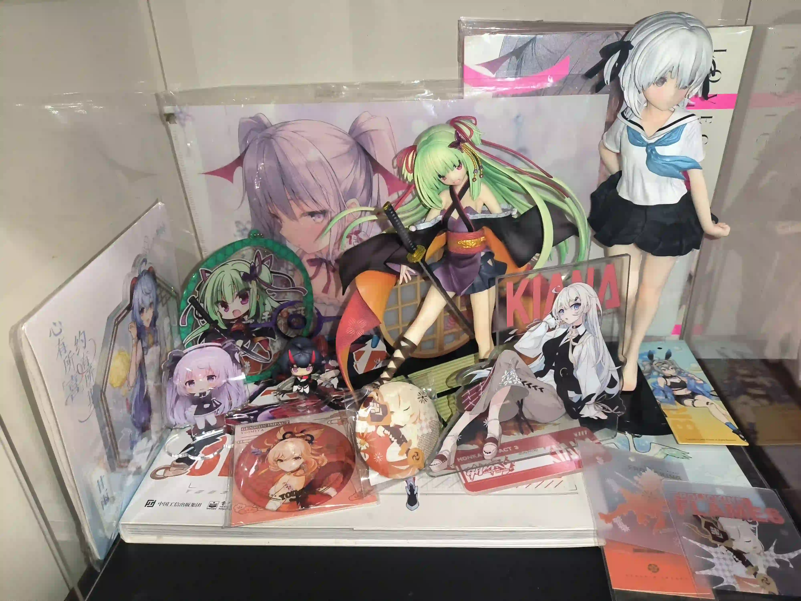
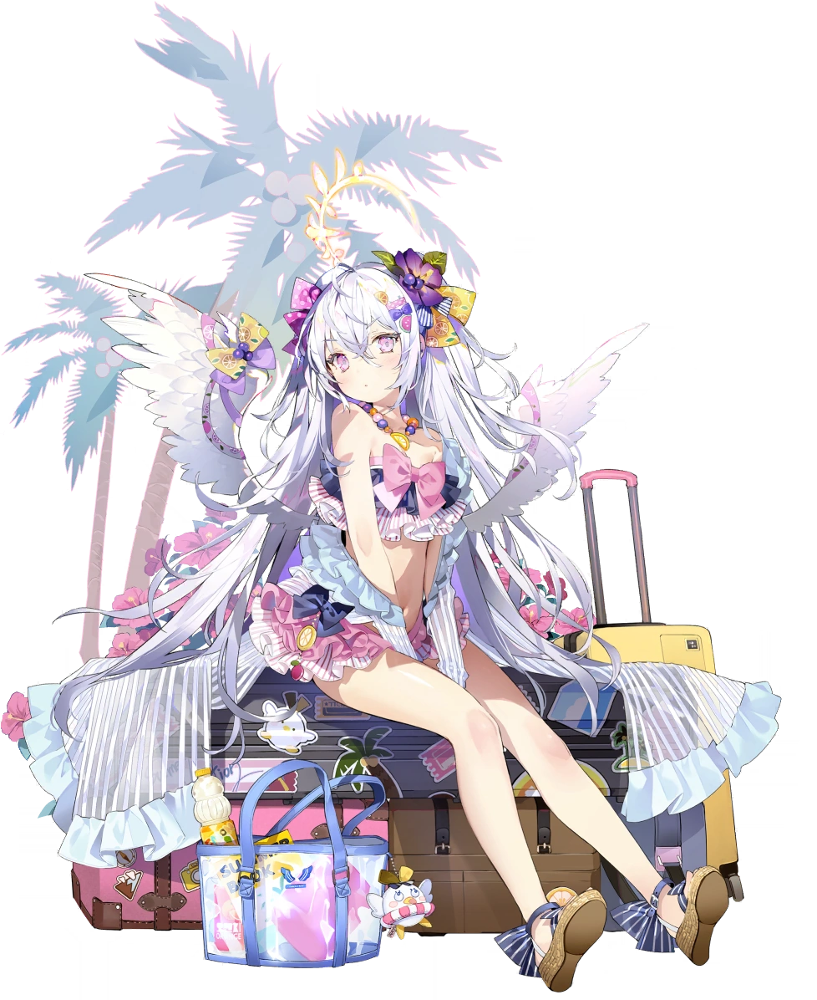
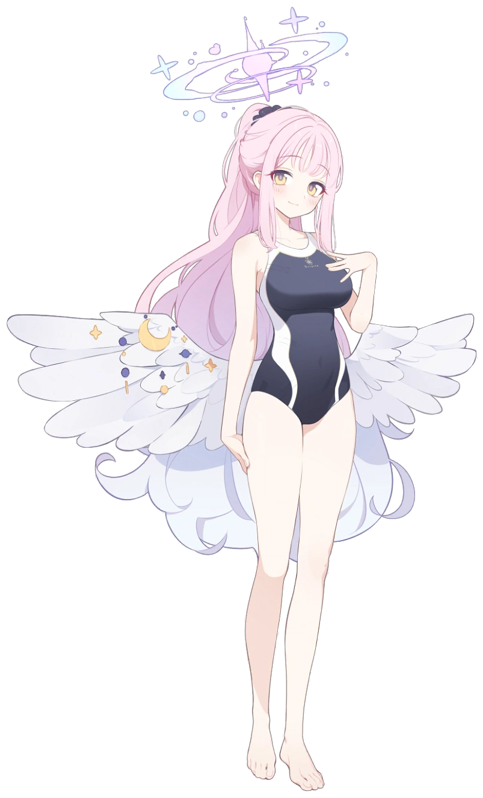
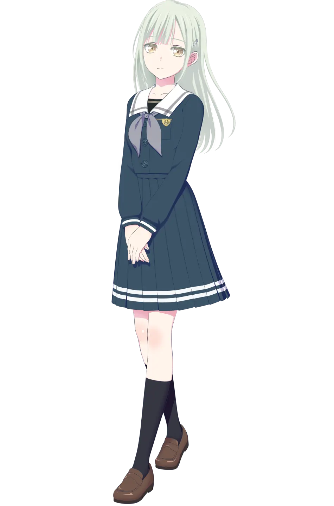
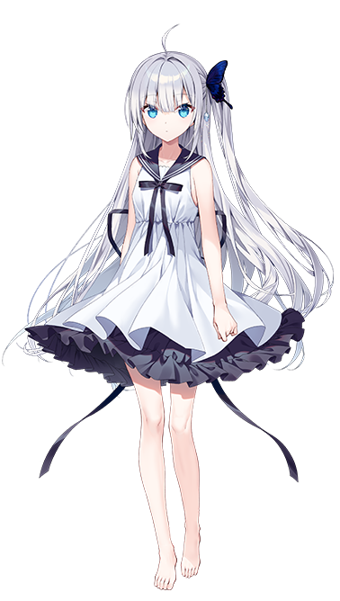

<h1>关于本站</h1>

    <h2>个人成分</h2>
    

        

            Unity3D, C#/python/html/js/css
        

        

            Unreal/C++学习中
        

        

            <ruby>宅<rt class="ttt" data-rt="Otaku"></rt>, 原教旨二次元游戏主义者
        

        <h3>爱好</h3>
        

            主要为<ruby>第一人称射击<rt class="ttt" data-rt="FPS"></rt></ruby>/<ruby>第三人称射击<rt class="ttt" data-rt="TPS"></rt></ruby>游戏, 但类型不受限
        

        

            日本商业动画<ruby>作画MAD<rt class="ttt" data-rt="作豚"></rt>, 日本新番
        

        <h3>头像画师</h3>
        

            <a href="https://www.pixiv.net/users/126858" target="_blank">
                @ゆさの
            </a>
        

        <h3>喜欢的插画画师</h3>
        

            <a href="https://www.pixiv.net/users/25760573" target="_blank">
                @rurudo</a>,
            <a href="https://www.pixiv.net/users/16731" target="_blank">
                @<ruby>玉<rt class="ttt" data-rt="tama"></rt>
                    之<rt class="ttt" data-rt="no"></rt>けだま
                </ruby></a>,
            <a href="https://www.pixiv.net/users/16051830" target="_blank">
                @Alpha</a>,
            <a href="https://www.pixiv.net/users/24234" target="_blank">
                @mignon</a>,
            <a href="https://www.pixiv.net/users/6049901" target="_blank">
                @<ruby>szcb911<rt class="ttt" data-rt="鬼針草"></rt></ruby></a>,等..
        

        <h3>喜欢的动画原画师</h3>
        
中村丰,阿部望,金子秀一

        <h3>喜欢的VOCALOID P主</h3>
        

            <a href="https://space.bilibili.com/177291194" target="_blank">
                @DECO*27</a>,
            <a href="https://space.bilibili.com/203655966" target="_blank">
                @<ruby>ピノキオピー<rt class="ttt" data-rt="PinocchioP"></rt>
                </ruby>
            </a>
        

    

---

<h1>军火</h1>

  

    
  

---

# 老婆墙

###### 都是我的翅膀持续更新

    

      

        
      

    

    
    
    
    
    
    
    
    

    <h2>姓名</h2>
    <h6>不分先后不按顺序</h6>
    

        原神...启动！
        

            <a href="./Character_Yoimiya_Full_Wish.webp" target="_blank"><ruby>宵宫<rt class="ttt" data-rt="Yoimiya"></rt></ruby></a>
        

        GINKA
        

            <a href="./nazo01.png" target="_blank">四之宫银花(<ruby>四ノ宮<rt class="ttt" data-rt="Shinomiya"></rt>銀花<rt class="ttt" data-rt="Ginka"></rt></ruby>)</a>、
            <a href="./ginka02.png" target="_blank"><ruby>ギンカ<rt class="ttt" data-rt="Ginka"></rt></ruby></a>
        

        蔚蓝档案(ブルーアーカイブ)
        

            <a href="./Azusa_Swimsuit_Portrait.webp" target="_blank">白洲梓(<ruby>白洲<rt class="ttt" data-rt="Shirasu"></rt>アズサ<rt class="ttt" data-rt="Azusa"></rt></ruby>)</a>、
            <a href="./Mika_School_Swimsuit_Portrait.webp" target="_blank">圣园未花(<ruby>聖園<rt class="ttt" data-rt="Misono"></rt>ミカ<rt class="ttt" data-rt="Mika"></rt></ruby>)</a>、
            <a href="./Mari_Gym_Portrait.webp" target="_blank">伊落玛丽(<ruby>伊落<rt class="ttt" data-rt="Iochi"></rt>マリー<rt class="ttt" data-rt="Mari"></rt></ruby>)</a>、
            <a href="./Miyako_(Swimsuit)_full.webp" target="_blank">月雪宫子(<ruby>月雪<rt class="ttt" data-rt="Tsukiyuki"></rt>ミヤコ<rt class="ttt" data-rt="Miyako"></rt></ruby>)</a>
        

        BanG Dream! It's MyGO!!!!!
        

            <a href="./Ave_mujica_member_Mutsumi.webp" target="_blank">若叶睦(<ruby>若葉<rt class="ttt" data-rt="Wakaba"></rt>睦<rt class="ttt" data-rt="Mutsumi"></rt></ruby>)</a>
        

        孤独摇滚!(ぼっち・ざ・ろっく!)
        

            <a href="./kita_ikuyo.webp" target="_blank"><ruby>喜多<rt class="ttt" data-rt="Kita"></rt>郁代<rt class="ttt" data-rt="Ikuyo"></rt></ruby></a>
        

    

