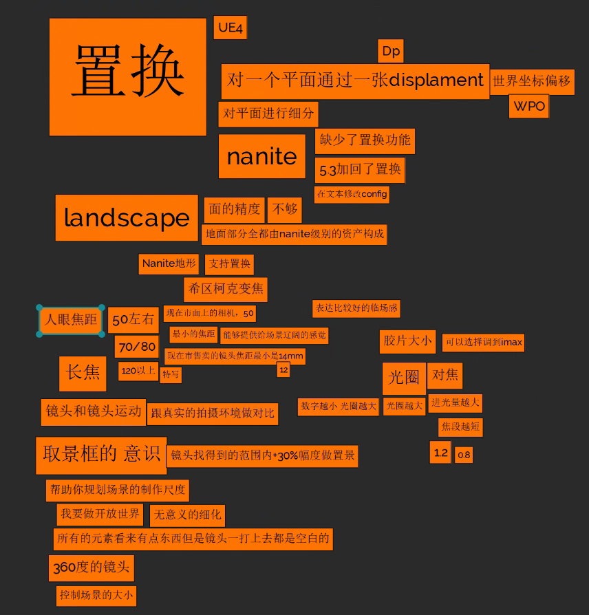
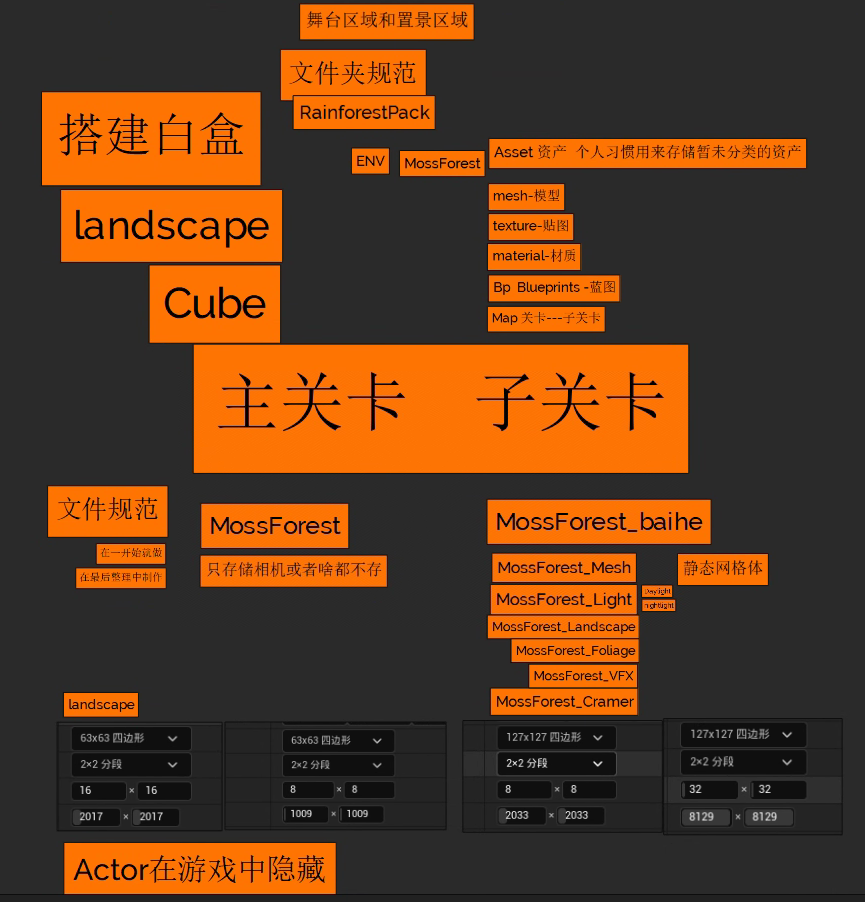
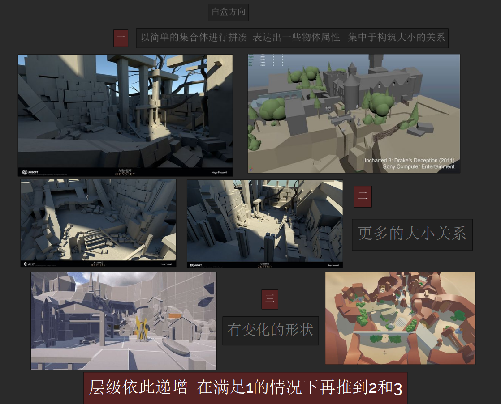

<!--more-->

## 目录

<table>
    <tr>
        <td colspan="10" style="text-align: center;"><a href="./#林深不知处"><b>林深不知处</a></td>
    </tr>
    <tr>
        <td><a href="./#Day1">Day1 基础操作</a></td>
        <td><a href="./#Day2">Day2 资产</a></td>
        <td><a href="./#Day3">Day3 白盒/Lumen</a></td>
        <td><a href="./#Day4">Day4 白盒细化</a></td>
        <td><a href="./#Day5">Day5 材质球</a></td>
        <td>Day6</td>
        <td>Day7</td>
        <td>Day8</td>
        <td>Day9</td>
        <td>Day10</td>
    </tr>
    <tr>
        <td colspan="10" style="text-align: center;"><b>Blender建模1</td>
    </tr>
    <tr>
        <td colspan="2">Day11</td>
        <td colspan="2">Day12</td>
        <td colspan="2">Day13</td>
        <td colspan="2">Day14</td>
        <td colspan="2">Day15</td>
    </tr>
    <tr>
        <td colspan="10" style="text-align: center;">春节</td>
    </tr>
    <tr>
        <td colspan="10" style="text-align: center;">春节</td>
    </tr>
    <tr>
        <td colspan="10" style="text-align: center;"><b>星骸骑士</td>
    </tr>
    <tr>
        <td>Day16</td>
        <td>Day17</td>
        <td>Day18</td>
        <td>Day19</td>
        <td>Day20</td>
        <td>Day21</td>
        <td>Day22</td>
        <td>Day23</td>
        <td>Day24</td>
        <td>Day25</td>
    </tr>
    <tr>
        <td colspan="2">Day26</td>
        <td colspan="2">Day27</td>
        <td colspan="2">Day28</td>
        <td colspan="2">Day29</td>
        <td colspan="2">Day30</td>
    </tr>
    <tr>
        <td colspan="10" style="text-align: center;"><b>旷野之息</td>
    </tr>
    <tr>
        <td>Day31</td>
        <td>Day32</td>
        <td>Day33</td>
        <td>Day34</td>
        <td>Day35</td>
        <td>Day36</td>
        <td>Day37</td>
        <td>Day38</td>
        <td>Day39</td>
        <td>Day40</td>
    </tr>
    <tr>
        <td colspan="2">Day41</td>
        <td colspan="2">Day42</td>
        <td colspan="2">Day43</td>
        <td colspan="2">Day44</td>
        <td colspan="2">Day45</td>
    </tr>
    <tr>
        <td colspan="10" style="text-align: center;"><b>Blender建模2</td>
    </tr>
    <tr>
        <td colspan="2">Day46</td>
        <td colspan="2">Day47</td>
        <td colspan="2">Day48</td>
        <td colspan="4" style="text-align: center;">清明</td>
    </tr>
    <tr>
        <td colspan="10" style="text-align: center;"><b>利物浦大街37号</td>
    </tr>
    <tr>
        <td>Day49</td>
        <td>Day50</td>
        <td>Day51</td>
        <td>Day52</td>
        <td>Day53</td>
        <td>Day54</td>
        <td>Day55</td>
        <td>Day56</td>
        <td>Day57</td>
        <td>Day58</td>
    </tr>
    <tr>
        <td colspan="10" style="text-align: center;"><b>Blender建模3</td>
    </tr>
    <tr>
        <td colspan="2">Day59</td>
        <td colspan="2">Day60</td>
        <td colspan="2">Day61</td>
        <td colspan="2">Day62</td>
        <td colspan="2">Day63</td>
    </tr>
    <tr>
        <td colspan="10" style="text-align: center;"><b>地平线GT</td>
    </tr>
    <tr>
        <td colspan="2">Day64</td>
        <td colspan="2">Day65</td>
        <td colspan="6" style="text-align: center;">劳动</td>
    </tr>
    <tr>
        <td colspan="2">Day66</td>
        <td colspan="2">Day67</td>
        <td colspan="2">Day68</td>
        <td colspan="2">Day69</td>
        <td colspan="2">Day70</td>
    </tr>

</table>

林深不知处

### Day1基础操作

###### 基础设置

###### 物体基本运动

UE怎么没有T快捷键的调整Object捏

坐标轴,与Unity等3d软件同理

f键:快速定位当前选中的Actor使摄像机对准

###### 降低开销

双视口+关闭阴影,无光照,实时

### Day2 资产

记得改Bridge的下载路径

吃饭喽

---

###### PureRef操作

去色 观察黑白信息 `ctrl`+`alt`+`g`

窗口最大化 `ctrl`+`f` 最小化 `ctrl`+`m`

置顶 `ctrl`+`shift`+`a`

添加文字 `ctrl`+`n`

### Day3 白盒/Lumen

### Day4 白盒细化

### Day5 材质球

Blender建模1

占位

材质

### Saturate

> 使值在[0,1]区间内

"Saturate"节点在材质编辑器（Material Editor）中扮演了一个很重要的角色。它主要被用来确保任何给定的值不会超过特定的范围，通常是0到1之间。简而言之，Saturate操作会将输入的任何值钳制（clamp）到0和1的范围内。如果输入的值小于0，它会被设为0；如果输入的值大于1，它会被设为1；如果输入的值在0和1之间，它则保持不变。

### Fraction / Frac

> 值取小数部分

"Fraction"节点用于材质编辑器（Material Editor）中，执行一个特定的数学操作。它的作用是获得一个数的小数部分。简单地说，当你向Fraction节点输入一个数值时，它会去掉该数值的整数部分，只返回其小数部分。这个节点在创建特殊的材质效果、进行某些数学计算时非常有用。

### Ceil

> 向上取整

"Ceil"节点用于材质编辑器（Material Editor），执行的是向上取整的数学操作。对于给定的浮点数，Ceil节点会返回大于或等于这个数的最小整数。简而言之，Ceil节点会将输入的任何小数部分舍去，但是如果输入是一个整数，则返回这个整数本身。这一操作对于某些特定的数学计算或者逻辑判断非常有用。

### Floor

> 向下取整

"Floor"节点是材质编辑器（Material Editor）中的一个数学函数节点，主要用于取得一个数值的整数部分，且该整数部分是小于或等于该数值的最大整数。具体来说，对于任何给定的浮点数，Floor节点会将其向下取整到最接近的整数值。

### Normalize

> 将任何非零向量转换成单位向量

"Normalize"节点用于标准化向量，也就是将任何非零向量转换成单位向量（即长度为1的向量）。这是通过将向量的每个组成部分除以其模长（即向量的长度）来实现的。Normalize节点在材质编辑器（Material Editor）和着色器编程中都非常常见，对于处理向量运算尤其重要。

### Desaturation

> 用于去饱和/过饱和

"Desaturation"节点用于材质编辑器（Material Editor）内，它的主要作用是对颜色进行去饱和处理。通过减少或移除颜色的饱和度，可以将彩色图像转换成灰度图像或接近灰度的效果，同时保持其亮度不变。这个节点在需要调整材质颜色饱和度、创建黑白效果，或者在生成艺术风格化材质的时候非常有用。

### ConstantBiasScale

> 偏移(Bias)和缩放(Scale)

"ConstantBiasScale"节点是材质编辑器（Material Editor）中一个用于进行数值处理的节点，它执行两个基本操作：偏移（Bias）和缩放（Scale）。这个节点对输入值首先应用一个偏移（即加上或减去一个常数值），然后对结果进行缩放（乘以一个常数值）。这种简单但极其有用的数学操作能够帮助调整材质属性值，使之更适合特定的视觉效果或逻辑需求。

