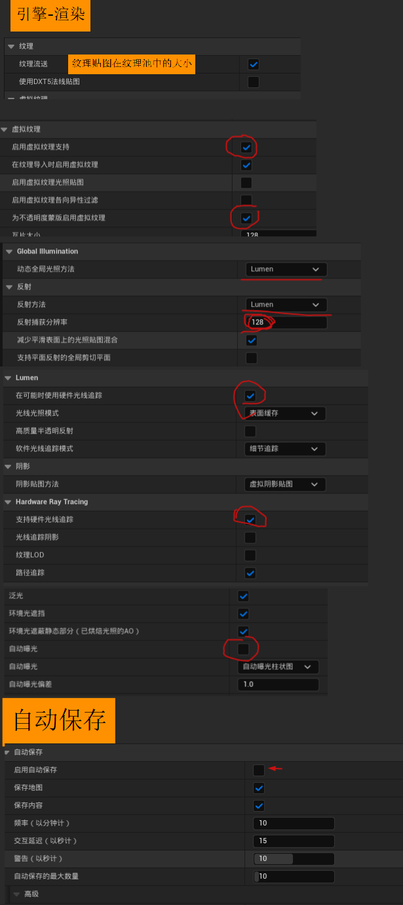

<!--more-->

## 目录

<table>
    <tr>
        <td colspan="10" style="text-align: center;"><b>林深不知处</td>
    </tr>
    <tr>
        <td><a href="./#Day1">Day1 基础操作</a></td>
        <td><a href="./#Day2">Day2 资产</a></td>
        <td>Day3</td>
        <td>Day4</td>
        <td>Day5</td>
        <td>Day6</td>
        <td>Day7</td>
        <td>Day8</td>
        <td>Day9</td>
        <td>Day10</td>
    </tr>
    <tr>
        <td colspan="10" style="text-align: center;"><b>Blender建模</td>
    </tr>
    <tr>
        <td colspan="2">Day11</td>
        <td colspan="2">Day12</td>
        <td colspan="2">Day13</td>
        <td colspan="2">Day14</td>
        <td colspan="2">Day15</td>
    </tr>
    <tr>
        <td colspan="10" style="text-align: center;">春节</td>
    </tr>
    <tr>
        <td colspan="10" style="text-align: center;">春节</td>
    </tr>
    <tr>
        <td colspan="10" style="text-align: center;"><b>星骸骑士</td>
    </tr>
    <tr>
        <td>Day16</td>
        <td>Day17</td>
        <td>Day18</td>
        <td>Day19</td>
        <td>Day20</td>
        <td>Day21</td>
        <td>Day22</td>
        <td>Day23</td>
        <td>Day24</td>
        <td>Day25</td>
    </tr>
    <tr>
        <td colspan="2">Day26</td>
        <td colspan="2">Day27</td>
        <td colspan="2">Day28</td>
        <td colspan="2">Day29</td>
        <td colspan="2">Day30</td>
    </tr>
    <tr>
        <td colspan="10" style="text-align: center;"><b>旷野之息</td>
    </tr>
    <tr>
        <td>Day31</td>
        <td>Day32</td>
        <td>Day33</td>
        <td>Day34</td>
        <td>Day35</td>
        <td>Day36</td>
        <td>Day37</td>
        <td>Day38</td>
        <td>Day39</td>
        <td>Day40</td>
    </tr>
    <tr>
        <td colspan="2">Day41</td>
        <td colspan="2">Day42</td>
        <td colspan="2">Day43</td>
        <td colspan="2">Day44</td>
        <td colspan="2">Day45</td>
    </tr>
    <tr>
        <td colspan="10" style="text-align: center;"><b>Blender建模</td>
    </tr>
    <tr>
        <td colspan="2">Day46</td>
        <td colspan="2">Day47</td>
        <td colspan="2">Day48</td>
        <td colspan="4" style="text-align: center;">清明</td>
    </tr>
    <tr>
        <td colspan="10" style="text-align: center;"><b>利物浦大街37号</td>
    </tr>
    <tr>
        <td>Day49</td>
        <td>Day50</td>
        <td>Day51</td>
        <td>Day52</td>
        <td>Day53</td>
        <td>Day54</td>
        <td>Day55</td>
        <td>Day56</td>
        <td>Day57</td>
        <td>Day58</td>
    </tr>
    <tr>
        <td colspan="10" style="text-align: center;"><b>Blender建模</td>
    </tr>
    <tr>
        <td colspan="2">Day59</td>
        <td colspan="2">Day60</td>
        <td colspan="2">Day61</td>
        <td colspan="2">Day62</td>
        <td colspan="2">Day63</td>
    </tr>
    <tr>
        <td colspan="10" style="text-align: center;"><b>地平线GT</td>
    </tr>
    <tr>
        <td colspan="2">Day64</td>
        <td colspan="2">Day65</td>
        <td colspan="6" style="text-align: center;">劳动</td>
    </tr>
    <tr>
        <td colspan="2">Day66</td>
        <td colspan="2">Day67</td>
        <td colspan="2">Day68</td>
        <td colspan="2">Day69</td>
        <td colspan="2">Day70</td>
    </tr>

</table>

### Day1 基础操作

###### 基础设置

###### 物体基本运动

UE怎么没有T快捷键的调整Object捏

坐标轴,与Unity等3d软件同理

f键:快速定位当前选中的Actor使摄像机对准

###### 降低开销

双视口+关闭阴影,无光照,实时

### Day2 资产

记得改Bridge的下载路径

吃饭喽

---

###### PureRef操作

去色 观察黑白信息 `ctrl`+`alt`+`g`

窗口最大化 `ctrl`+`f` 最小化 `ctrl`+`m`

置顶 `ctrl`+`shift`+`a`