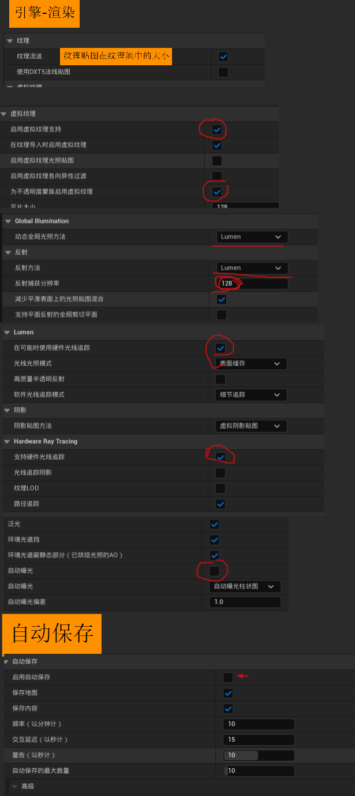
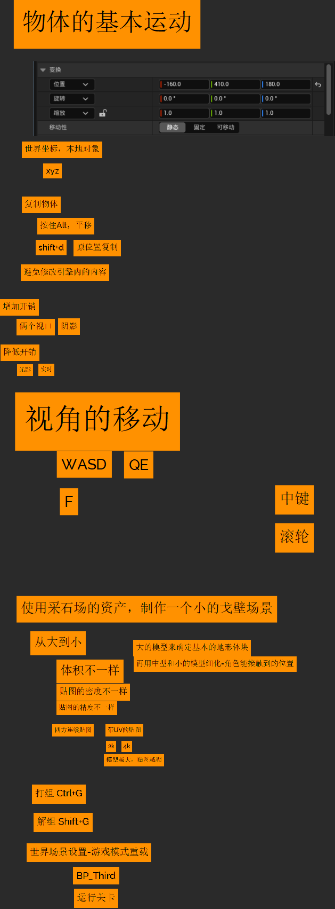
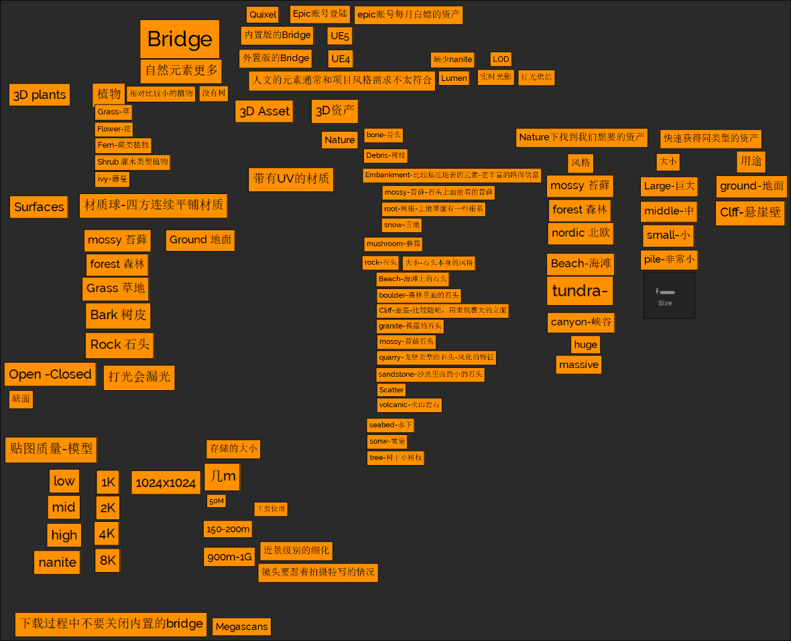
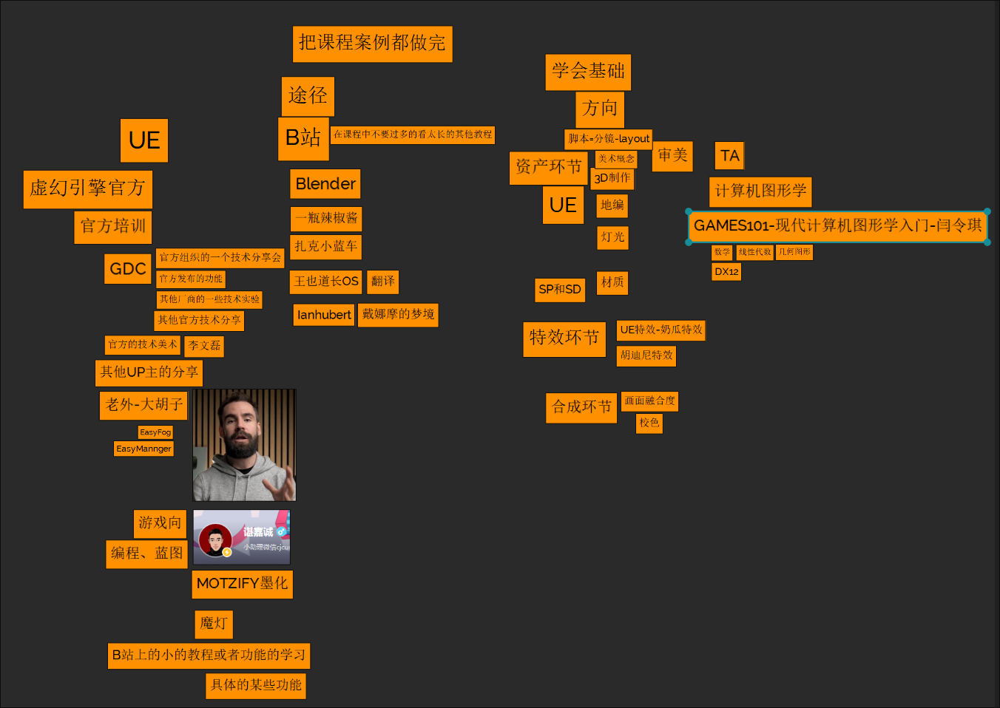

<!--more-->

<table>
    <tr>
        <td colspan="10" style="text-align: center;">UE5</td>
    </tr>
    <tr>
        <td colspan="10" style="text-align: center;">基础部分</td>
    </tr>
    <tr>
        <td><a href="./#Day1">Day1 基础操作</a></td>
        <td><a href="./#Day2">Day2 资产</a></td>
        <td>Day3</td>
        <td>Day4</td>
        <td>Day5</td>
        <td>Day6</td>
        <td>Day7</td>
        <td>Day8</td>
        <td>Day9</td>
        <td>Day10</td>
    </tr>
    <tr>
        <td colspan="10" style="text-align: center;">林深不知处</td>
    </tr>
    <tr>
        <td>Day11</td>
        <td>Day12</td>
        <td>Day13</td>
        <td>Day14</td>
        <td>Day15</td>
        <td>Day16</td>
        <td>Day17</td>
        <td>Day18</td>
        <td>Day19</td>
        <td>Day20</td>
    </tr>

</table>

### Day1 基础操作

###### 基础设置

###### 物体基本运动

UE怎么没有T快捷键的调整Object捏

坐标轴,与Unity等3d软件同理

f键:快速定位当前选中的Actor使摄像机对准

###### 降低开销

双视口+关闭阴影,无光照,实时

### Day2 资产

记得改Bridge的下载路径

吃饭喽

