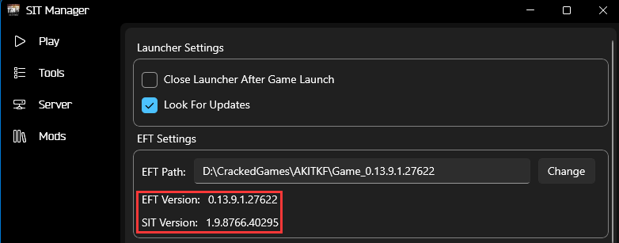
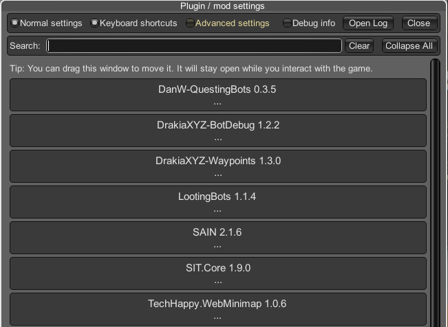
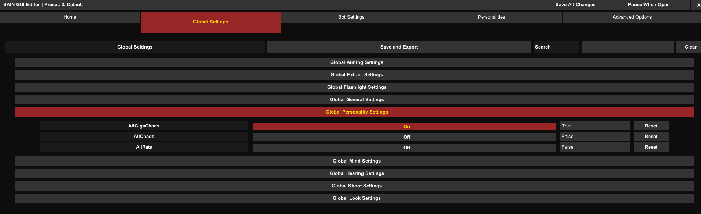
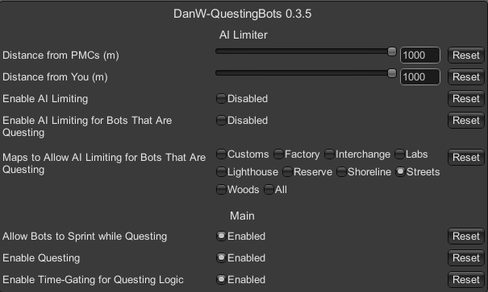
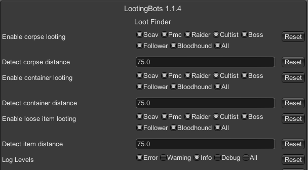

> 你最好是给我全文仔细的看一遍

<!--more-->

## 目录

- [下载链接](#下载链接)
- [步骤教程](#步骤教程)
- [进阶](#进阶)
- [Q&A](#qa)
- [建议设置](#建议设置)
- [服务端调整](#服务端调整)
- [服务器已知问题](#服务器已知问题)

---

### 下载链接

密码h***,来问我

推荐用IDM插件搭配IDM下载Onedrive相关文件

- `必须下载`:[[Onedrive] 游戏本体 0.14.0.0.28375 [23.9GB]](https://ygt3z-my.sharepoint.com/:u:/g/personal/topidolproducer_ygt3z_onmicrosoft_com/EVQxM56DgwxGl_VOcNK2ezkB6zUqfM2bKB_vYTz2PY2x2A?e=JDQxJy)
- `必须下载`:[[Onedrive] 降级补丁 0.14.0.0.28375 → 0.13.9.1.27622 [2.45GB]](https://ygt3z-my.sharepoint.com/:u:/g/personal/topidolproducer_ygt3z_onmicrosoft_com/ET3ZSu2wMDtPsXFJ-qMjvd4B_9PlwjcFsLkIcBam8OfK-w?e=HvhaLV)
- **单补丁按需下载**:[[Onedrive] 免正版验证的联机补丁(若安装mod则不需要单独下载,补丁已整合在ExtendMod中) [512KB]](https://ygt3z-my.sharepoint.com/:u:/g/personal/topidolproducer_ygt3z_onmicrosoft_com/EWKlVF3nT1xMiCgTBVosdNcBfqH5EhwdYsM-4ZJxJwE7vA?e=kegEbW) (v2024.1.18)
- **按需下载**:[[Onedrive] ExtendMod [113MB]](https://ygt3z-my.sharepoint.com/:u:/g/personal/topidolproducer_ygt3z_onmicrosoft_com/EfksY34CqfVGhbso0b1LyK0Bm5upJJmQyAUQXL9I3dYhFg?e=RWa60e) (v2024.1.18)
- 按需下载:[.NET Runtime 专用启动器必需的运行环境](https://dotnet.microsoft.com/en-us/download/dotnet/thank-you/runtime-desktop-8.0.0-windows-x64-installer)

如果<ruby>专用启动器<rt class="ttt" data-rt="SIT Manager.exe"></rt></ruby>能正常启动的话也可以不安装运行环境,但可能会出现界面的图标错乱

- `必须下载`:[[Onedrive] <ruby>专用启动器<rt class="ttt" data-rt="SIT Manager.exe"></rt></ruby> [31.2MB]](https://ygt3z-my.sharepoint.com/:u:/g/personal/topidolproducer_ygt3z_onmicrosoft_com/ESnFJVBZ1b1PsglaDqnDY4wBQaxcYEI3mXkr4cHbwUxK8w?e=8UfF4G)
- 按需下载:[Radmin LAN 局域网联机软件](https://download.radmin-lan.cn/download/files/Radmin_LAN_1.4.4642.1.exe) / 带公网的服务器
- 只需服主下载:[[Onedrive] SITCoop 服务端Mod 1.9.8767.26420 [16.2MB]](https://ygt3z-my.sharepoint.com/:u:/g/personal/topidolproducer_ygt3z_onmicrosoft_com/ESX3_3_-CyZLn99GGK0dvvoBD8WpEhaweVA_-1R3Gj_2dQ?e=SthiHd)
- 只需服主下载:[服务端SPT-AKI 3.7.6 Release-26535](https://dev.sp-tarkov.com/attachments/d549e35d-998c-4986-8c78-64571a6e083c)

---

## 步骤教程

- 创建一个目录(所有目录名不能为中文),名称自定,用`{Root}`来指代

#### 玩家步骤

- 将**游戏本体**解压到`{Root}`下,该目录用`{Game}`指代
- 将**降级补丁**解压并将里面的文件粘贴到`{Game}`下,运行`patcher.exe`,会自动将游戏降级,得到0.13.9.1.27622版本的纯净版塔科夫,之后的所有步骤都建立在纯净版的基础上
> 强烈建议补丁运行完毕之后复制一份降级后的游戏本体到别处作为备份,除非步骤出错时你想再重复一次解压游戏本体和降级的过程,保留纯净版备份方便你重头再来
- 下载并安装**专用启动器必需的运行环境**
- 将**专用启动器**解压到`{Root}`下,用`{Launcher}`指代

<blockquote style="background-color:#5f4040;box-shadow:3px 0 0 0 #d85959 inset;margin:10px 0 0 0;">
  从此处开始必须全程翻墙,确保拥有能够流畅访问Github的网络环境,在启动器Install SIT时必须一气呵成,如果下载安装的过程中以任何形式停止了安装,恭喜你,直接从降级结束后开始。这就是为什么最好备份一个降级后的游戏本体当备份
</blockquote>

- 启动`{Launcher}`下的`SIT Manager.exe`
- - 点击`Settings`
- - `EFT Settings`中选择`EFT Path`的路径为`{Game}`
- - 点击`Tools`,选择`Install SIT`
- - 选择`StayInTarkov.Client-1.9.8766.40295 - Tarkov Version: 0.13.9.1.27622`,安装

##### 如果是局域网联机

- 下载安装**Radmin LAN 局域网联机软件**
- - 网络→加入网络→私人网络
- - 填写私人网络对应的名称和密码(由创建私人网络的房主提供)

##### 如果是公网服务器

- 无需特殊操作, 只需问服主提供的IP地址

##### 连接登录

- 使用`SIT Manager`填写对应的`Address`为`http://{Radmin中服主的IP/服务器公网IP}:6969`
- 若服主已开服,`SIT Manager` Connect进入游戏

---

#### 服主开服步骤

<details>

<summary>服主点开看</summary>

- 启动`{Launcher}`下的`SIT Manager.exe`
- - 点击`Settings`
- - `EFT Settings`中选择`SPT-AKI Path`的路径为`{Server}`
- 直接运行`{Server}/Aki_Server.exe`或者在`SIT Manager`的Server中直接Start Server,此时将会生成服务器最初的配置文件
- - 看到**玩得开心**或者**happy playing**即可关闭
- 将**服务端Mod**解压到`{Server}/user/mods`下(如果你直接安装下文的整合包,这一步可以跳过),再次Start Server,此时将会生成联机Mod的配置文件
- - 看到**玩得开心**或者**happy playing**即可关闭
- 防火墙打开`6969`和`6970`端口

##### 如果是局域网联机

- 下载安装**Radmin LAN 局域网联机软件**
- - 网络→创建私人网络
- - 填写名称和密码,并提供给想要加入的玩家

##### 公网服务器

- 无需特殊操作, 记录服务器的IP地址或域名

##### 修改配置文件

- 打开`{Server}/Aki_Data/Server/configs/http.json`,进行修改:
```json
{
  "ip": "0.0.0.0",
  "port": 6969,
  "webSocketPingDelayMs": 90000,
  "logRequests": true,
  "serverImagePathOverride": {	}
}
```
- 打开`{Server}/user/mods/SITCoop/config/coopConfig.json`,进行修改:
```json
{
  "protocol": "http",
  "externalIP": "{你的Radmin IP/公网服务器IP}",
  "webSocketPort": 6970,
  "webSocketTimeoutSeconds": 5,
  "webSocketTimeoutCheckStartSeconds": 120
}
```
- 启动服务器,完成开服

</details>

---

### 进阶

以上是基础流程,下面为进阶版,将为服务端和客户端新增改变AI逻辑的mod

由于SIT模组的代码为专门编写,因此不兼容一般的SPT模组,所以必须使用被SIT开发组特别编译过的能够兼容SIT的mod版本,才能使用

以下是整合包链接:

- [[Onedrive] ExtendMod [113MB]](https://ygt3z-my.sharepoint.com/:u:/g/personal/topidolproducer_ygt3z_onmicrosoft_com/EfksY34CqfVGhbso0b1LyK0Bm5upJJmQyAUQXL9I3dYhFg?e=RWa60e) (v2024.1.18)

整合包已内置了过正版验证的`StayInTarkov.dll`

整合包分为`GameSide`,`ServerSide`

将`GameSide`里!的!内!容!直接放入到`{Game}/`下,GameSide为所有人都需要安装

不要把`GameSide`这个文件夹都整个丢过去,下面的`ServerSide`同理

将`ServerSide`里的内容直接放入到`{Server}/`下,ServerSide则只需要服主安装

目前ExtendMod中包含:

- [SAIN/原文链接](https://hub.sp-tarkov.com/files/file/1062-sain-2-0-solarint-s-ai-modifications-full-ai-combat-system-replacement/):大型AI逻辑改变MOD,完全取代战斗逻辑,F6打开图形配置界面
- - 会根据声音做出反应,如听到枪声会前往侦察,听到玩家掏手雷会主动出击
- - 交战时AI会做出更符合玩家的操作,如受伤会冲刺躲藏到掩体后回状态,从掩体后进行侧身攻击或者盲射
- - 索敌范围会受到天空亮度和天气影响,会被植物遮挡视线,不再能够透视
- - 会出现小组集体行动
- `Waypoints`:前置MOD
- [LootingBots/原文链接](https://hub.sp-tarkov.com/files/file/1096-looting-bots/):掠夺BOT,AI逻辑改变MOD
- - AI会定期检测周围的战利品,会像玩家一样进行搜刮,同时换掉身上的武器装备,也会将搜刮到的高价值物品放入背包
- - AI PMC不再会以身上直接带着高价值物品的状态出生
- [QuestingBots/原文链接](https://hub.sp-tarkov.com/files/file/1534-questing-bots/#overview):AI逻辑改变MOD
- - 模拟线上战局AI PMC可能会在开局时刻立即生成在随机PMC复活点
- - AI PMC会随机获得塔科夫中真实的任务作为目标,将会尝试前往任务地点放置物品,或者击杀敌人等来完成任务,不再简单地在出生区域巡逻;
- - 可能会出现组队PMC,其他成员陪同完成队长PMC的任务
- - 如果出生时距离过近可能会让PMC直接突脸玩家,且如果靠近空投区域也会去抢空投
- `ConfigurationManager`:mod配置管理器(未安装SAIN时在游戏中F1打开,安装SAIN后为F12打开)
- `BotDebug`:配合`ConfigurationManager`使用,用于检查AI mod的生效是否正常
- `MinimapSender`:可在浏览器或手机上打开[http://localhost:8080/index.html](http://localhost:8080/index.html),即可查看实时地图,雷达外挂同原理的低配版
- `LiveFleaPrices`:可获取实时跳蚤市场价格,但需要服务器网络环境处于能够翻墙的状态

> 整合包的内容必须适配本文提到的服务端版本和游戏版本,若全程都已按照本文教程安装,那么整合包应该可以直接使用






#####  最终目录结构自查

以下出现的内容必须在游戏目录中存在(v2024.1.18)

```
{Game}
└─BepInEx
   └─plugins
       ├─custom
       │  └─Solarint
       |     └─ ...
       ├─navmesh
       |  └─ ...
       ├─SAIN
       |  └─ ...
       ├─TechHappy-MinimapSender
       |  └─ ...
       ├─ConfigurationManager.dll
       ├─DrakiaXYZ-BotDebug.dll
       ├─SAIN.dll
       ├─skwizzy.LootingBots.dll
       ├─SPTQuestingBots.dll
       ├─StayInTarkov.dll
       └─TechHappy.MinimapSender.dll
```

---

### Q&A

- `关于联机mod的运作逻辑`

总所周知,离线版是只实现了单人战局代码的版本,因此联机mod等于是把联机代码的部分补全了,但是这就有一个问题,离线版的其他原生mod都是基于单人战局的情况下制作的,如果直接放到打了联机mod的离线版中,是不能直接使用的,因为这些原生mod如果会和服务端通信的话,他是不会同步给其他玩家的

因此大多数mod若想要安装到使用了联机mod的塔科夫中的话,必须使用经过联机mod开发团队的重新编写版本,也就是适配过联机功能后的mod版本

而塔科夫的大部分逻辑都是在本地运行的,由房间主人承担运算任务,服务器只进行同步和保存,所以在联机mod下时,房主安装的mod是否正常生效直接影响到整个房间内的情况。这也是为什么搭建塔科夫的私服服务器cpu要求不高,只需要内存够大,网速够快就行了

如房主安装了AI逻辑改变mod,当房主创建房间后,AI的行为逻辑都会由房主进行计算,其他进入到房间的玩家此时调整AI的配置文件是影响不了房主的配置的,如果房主的AI设置里把难度调得很变态,其他玩家也只能接受这样难度下的敌人。如果房主掉线了,AI很有可能就会丢掉脑子,无法运作只能原地发呆了,所以房主尽量不要退出房间。房主的AI mod如果没安装好,就算整个房间内的其他人的AI mod都正常生效也没有意义

- `关于AI逻辑`

因为AI逻辑由房主运算,因此每个房主的设置不同会导致每个房间的AI的行为都不一致,所以要么让所有玩家都使用同样的配置文件保证AI的行为一致,也可以特立独行

具体配置相关可查看mod列表的原文链接中的说明

---

### 建议设置

###### SAIN MOD

游戏中`F6`打开`SAIN GUI Editor`→`Global Settings`→`Global Personailty Settings`→`AllGigaChads改为On`→`Save and Export`保存

这是AI性格的修改,GigaChad会让AI更具有攻击性,更爱嘲讽敌人,能减少AI爱当蹲比少说话的情况,推荐所有当房主的玩家修改

[](03.png)

###### QuestingBots MOD

游戏中`F12`打开`ConfigurationManager`→`DanW-QuestingBots`→`Distance from PMCs和Distance from You`数值调高

如果玩家距离AI超过这个数值,AI就不会继续运作了,所以推荐调高



###### LootingBots MOD

游戏中`F12`打开`ConfigurationManager`→`LootingBots`→`Enable corpse looting`/`Enable container looting`/`Enable loose item looting`中的选项全部打开

这影响到对应的AI是否会搜刮对应的战利品



---

### 服务端调整

- 跳蚤市场1级开放
- 跳蚤市场交易税为1%
- 跳蚤上架的物品70%的概率能卖出去
- 跳蚤上架的溢价物品和低价物品被买走所花费的时间减少
- 跳蚤市场的物品价格下调
- 回保时间固定为0~1小时内,需要战局结束或重新登录时才能收到邮件
- 任务奖励/回保物品在邮件中存储的时间翻倍
- 投保物品95%的概率能够回保
- 投保物品费用为物品价值的12%

### 服务器已知问题

##### 偶发性的保存失败

服务端每20秒会对所有玩家的存档进行一次保存,通常保存一个玩家存档的时间仅需20几毫秒

如果某个玩家的存档未能在20秒内保存完成,但此时服务端又对这个玩家的存档进行保存的话,就会产生冲突,生成一个该玩家存档名称的带.lock后缀的文件夹,当这个文件夹存在时,该玩家的存档无法被保存。好端端的你也不知道为什么他突然某次保存存档的时候花的时间就超过了20秒,于是就会保存失败

但是就算保存失败已经发生了,该玩家也依然能够正常玩游戏,因为此时存档信息临时运行在玩家的电脑上,但如果你退出了游戏,下一次再进游戏时,读取到的就将是服务器那边传来的存档信息

因此我写了一个脚本每20秒检测一次目录中是否有.lock后缀的文件夹,若检测到则自动删除文件夹,问题得到解决

但是这方法不能根治问题

##### 神秘的闪退

当服务器运行一段时间后,随机触发一个应用程序的消失,有时是塔科夫服务端没了,有时是删除.lock的脚本没了

日志中没有任何报错,每次隔一段时间打开后台看看服务器就可能发现两个程序都没了

至今不知道原因,除非我24小时盯着屏幕看到发生时的那一幕,十分的神秘


##### 世界线的收束

当上述两个bug同时发生时,将会触发史上最恶劣的情况: 该玩家的存档进度停留在最后一次保存成功的时间节点,也就是传说中的

<span style="font-size: 25px">该 玩 家 的 进 度 被 回 档</span>